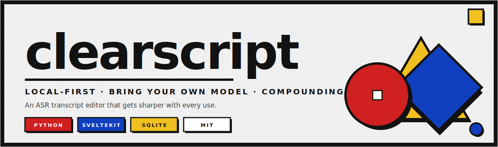
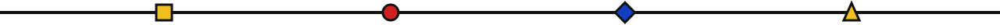

<!-- markdownlint-disable MD033 MD041 -->

<p align="center">
  
</p>

<p align="center">
  <a href="./LICENSE"></a>
  <a href="https://www.python.org/downloads/"></a>
  <a href="https://github.com/Chen17-sq/clearscript/releases"></a>
  <a href="https://github.com/Chen17-sq/clearscript/actions/workflows/ci.yml"></a>
  <a href="./README.zh-CN.md"></a>
</p>

<p align="center">
  <b>Local-first</b>  ·  <b>Bring your own model</b>  ·  <b>Compounding library</b>
</p>

<hr>

## What it is

**clearscript** turns raw speech-to-text output into archive-grade, shareable transcripts. It runs on your machine, works with whichever model you choose, and gets sharper every time you use it.

It is the open-source successor to a personal Claude skill that has been used on hundreds of VC reference checks, founder interviews, board meetings, and podcast recordings.

<table>
<tr>
<td width="33%" valign="top">

### 🟥 &nbsp;Local-first

Transcripts and the terminology library live on your disk. No accounts, no telemetry, no cloud dependency. The only network call is the one you authorize — your chosen LLM provider.

</td>
<td width="33%" valign="top">

### 🟦 &nbsp;Bring your own model

Five adapters cover **20+ services**: Anthropic · OpenAI · DeepSeek · Moonshot · Qwen · Together · Groq · Fireworks · Mistral · OpenRouter · Google Gemini · Ollama · llama.cpp · LM Studio · custom endpoints (incl. Colab tunnels).

</td>
<td width="33%" valign="top">

### 🟨 &nbsp;Compounding library

A local SQLite knowledge base of terms, speakers, and edit patterns that grows with every session. Next session pre-loads the relevant subset automatically. Markdown views auto-export — human-readable and git-trackable.

</td>
</tr>
</table>

<p align="center"></p>

## Why it exists

Existing transcript-cleanup tools fall into two camps:

- **Cloud SaaS** (Otter, Rev, Sonix): your audio and text get uploaded, processed by a closed model, and stored on someone else's servers. Privacy is a checkbox, not an architecture.
- **Generic LLM chats** (paste into ChatGPT): every session starts from zero. The model has no memory of who your speakers are, what your industry's jargon looks like, or which corrections you've made a hundred times before.

clearscript is the third option:

<table>
<thead>
<tr>
  <th></th>
  <th align="center">Cloud SaaS</th>
  <th align="center">Plain LLM chat</th>
  <th align="center"><b>clearscript</b></th>
</tr>
</thead>
<tbody>
<tr><td>Data stays local</td><td align="center">✗</td><td align="center">✗</td><td align="center"><b>✓</b></td></tr>
<tr><td>Bring your own model</td><td align="center">✗</td><td align="center">✗</td><td align="center"><b>✓</b></td></tr>
<tr><td>Works offline (with local model)</td><td align="center">✗</td><td align="center">✗</td><td align="center"><b>✓</b></td></tr>
<tr><td>Compounding terminology library</td><td align="center">✗</td><td align="center">✗</td><td align="center"><b>✓</b></td></tr>
<tr><td>Reproducible / audit trail</td><td align="center">✗</td><td align="center">✗</td><td align="center"><b>✓</b></td></tr>
<tr><td>Multi-format input/output</td><td align="center">partial</td><td align="center">✗</td><td align="center"><b>✓</b></td></tr>
</tbody>
</table>

<p align="center"></p>

## Quick start

> Requires Python 3.11+ and [uv](https://docs.astral.sh/uv/).

```bash
git clone https://github.com/Chen17-sq/clearscript.git
cd clearscript
uv sync
export ANTHROPIC_API_KEY=sk-ant-...   # or DEEPSEEK_API_KEY / OPENAI_API_KEY / GEMINI_API_KEY
```

### Option 1 — Web UI (recommended)

```bash
uv run clearscript serve
```

Opens **http://127.0.0.1:7681** in your browser. Bauhaus-styled single-page interface: pick a provider pill, paste or drag in your transcript, click **Clean transcript**, download as `.md` / `.docx`.

### Option 2 — CLI

```bash
uv run clearscript run examples/01-basic-cleanup/input.txt --provider claude
```

The cleaned transcript is written next to the input as `input.cleaned.md`, with a JSON change log alongside.

Prefer a different model?

```bash
# OpenAI-compatible (DeepSeek, Moonshot, Qwen, Together, Groq, Fireworks, Mistral, OpenRouter, ...)
export DEEPSEEK_API_KEY=sk-...
uv run clearscript run input.txt --provider deepseek

# 100% local (Ollama / llama.cpp server / LM Studio)
uv run clearscript run input.txt --provider ollama --model qwen2.5:14b
```

<p align="center"></p>

## Status

> **v0.0.4 — pre-alpha.** Local web UI ships a Bauhaus-styled Editor + Library tabs; multi-format ingest (`.txt / .md / .docx / .srt / .vtt / .json`); compounding terminology library with Mode A activation and Mode B harvest. Full v0.1 plan: see [ROADMAP](./docs/ROADMAP.md).

### Supported input formats today

| Format | Source examples |
|---|---|
| `.txt` | Generic, with speaker-label heuristics |
| `.md` | Auto-strips AI-summary blocks (English + Chinese) |
| `.docx` | 飞书妙记 / 腾讯会议 / 通义听悟 / generic Word |
| `.srt` | SubRip subtitle, time-stamped |
| `.vtt` | WebVTT (honors `<v Speaker>` voice tags) |
| `.json` | OpenAI Whisper / PLAUD / Google STT / Deepgram / generic flat list |

<table>
<tr>
<td width="50%" valign="top">

### Shipped in v0.0.1

- 5 LLM provider adapters (20+ services)
- `.txt` ingest with speaker heuristics
- SQLite library: terms / aliases / speakers / patterns / sessions / negatives + FTS5
- Single-pass pipeline (ingest → LLM → md/docx + JSON changelog)
- CLI: `run`, `providers`, `lib stats / add-term / lookup`
- Bundled prompt library (system + 7 stage prompts + 7 layer specs)
- User overrides via `~/.config/clearscript/prompts/`
- Bilingual docs, MIT license, full GitHub templates
- 27 unit tests, CI on macOS + Linux + Windows × Py 3.11/3.12/3.13

</td>
<td width="50%" valign="top">

### Coming in v0.1

- 12 ASR input formats (Feishu Miaoji, Typeless, Tongyi Tingwu, Tencent Meeting, Yuanbao, PLAUD, SRT, VTT, JSON, HTML, LRC, etc.)
- Full pipeline decomposition (pre-scan → context briefing → chunking → self-review → batch-ask → re-scan)
- L3.5 sentence-level reasoning layer
- SvelteKit web UI with [Bauhaus design system](./docs/DESIGN_SYSTEM.md)
- Library Mode A (project-start activation) and Mode C (in-flight learning)
- PyInstaller-packaged desktop installers (.app · .exe · .AppImage)
- MkDocs Material doc site auto-deployed to GitHub Pages

</td>
</tr>
</table>

<p align="center"></p>

## Design principles (non-negotiable)

These constrain every feature decision:

- 🟥 &nbsp;**No telemetry.** Ever. Not opt-in, not anonymous, not "just for crashes."
- 🟦 &nbsp;**No mandatory network calls** beyond the user's chosen LLM provider.
- 🟨 &nbsp;**No proprietary data formats.** Markdown, SQLite, JSON — readable from outside clearscript forever.
- ⬛ &nbsp;**No assumed cloud services.** If it requires an account somewhere, it's behind a setting that's off by default.

<p align="center"></p>

## Project layout

```
clearscript/
├── src/clearscript/         # Python package
│   ├── core/                # Pipeline orchestration
│   ├── ingest/              # ASR-format parsers
│   ├── providers/           # LLM provider adapters
│   ├── library/             # Terminology knowledge base
│   ├── layers/              # Edit layers (L1-L6 + L3.5 + Self-review)
│   ├── export/              # Output formatters
│   ├── storage/             # Project filesystem layout
│   └── prompts/             # LLM prompt templates (markdown, user-overridable)
├── web/                     # SvelteKit web UI (v0.1 onward)
├── tests/                   # pytest suite
├── docs/                    # MkDocs site sources + design system + assets
└── examples/                # Synthetic before/after samples
```

Read [`docs/architecture.md`](./docs/architecture.md) for the full pipeline contract.

<p align="center"></p>

## Contributing

Issues and PRs welcome. See [`CONTRIBUTING.md`](./CONTRIBUTING.md). Easy ways to help:

- **Add an ASR format adapter** — write a parser for a tool we don't yet support
- **Suggest ASR error patterns** — open an issue with `ASR original → correct` pairs you've seen
- **Test with your own model** — try a provider we haven't smoke-tested and report
- **Contribute a domain pack** (post-v0.3) — industry-specific terminology bundles

<p align="center"></p>

<p align="center">
  
</p>
<p align="center"><sub><b>clearscript</b> · Released under the <a href="./LICENSE">MIT License</a> · Built for people who care about their transcripts</sub></p>
